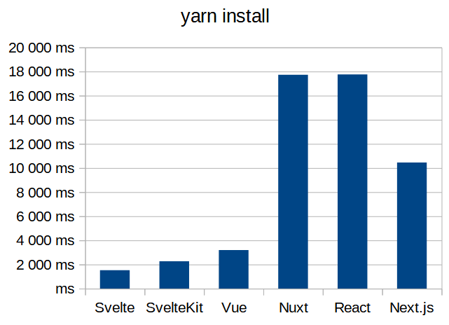
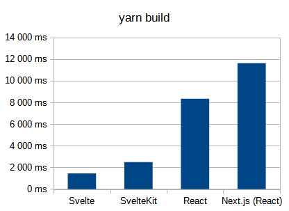
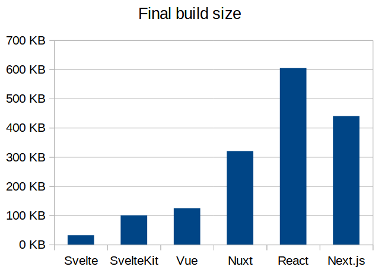

A raw benchmark of how much time it takes to install & build React & Svelte apps, and their build size.

Example of result on my machine:

```
❯ ./test.bash
 Cleaning up... Done!
 Making sure processtime is installed... Done!
 Installing node dependencies... Done!
 Building projects as static websites... Done!
 Gathering complete build size... Done!
 Results for node dependencies:
 ➡ svelte yarn install:       1333 ms
 ➡ svelte_kit yarn install:   1539 ms
 ➡ react yarn install:        15585 ms
 ➡ react_next yarn install:   5412 ms
 Results for build time:
 ➡ svelte build time:       1614 ms
 ➡ svelte-kit build time:   2548 ms
 ➡ react build time:        9213 ms
 ➡ react-next build time:   14156 ms
 Results for build size:
 ➡ svelte build size:       32 KB
 ➡ svelte_kit build size:   100 KB
 ➡ react build size:        604 KB
 ➡ react_next build size:   440 KB
```

Pictured results:

| yarn install<br>(in ms, lower is better) | yarn build<br>(in ms, lower is better) | build size<br>(in KB, lower is better) |
| --- | --- | --- |
|  |  |  |

