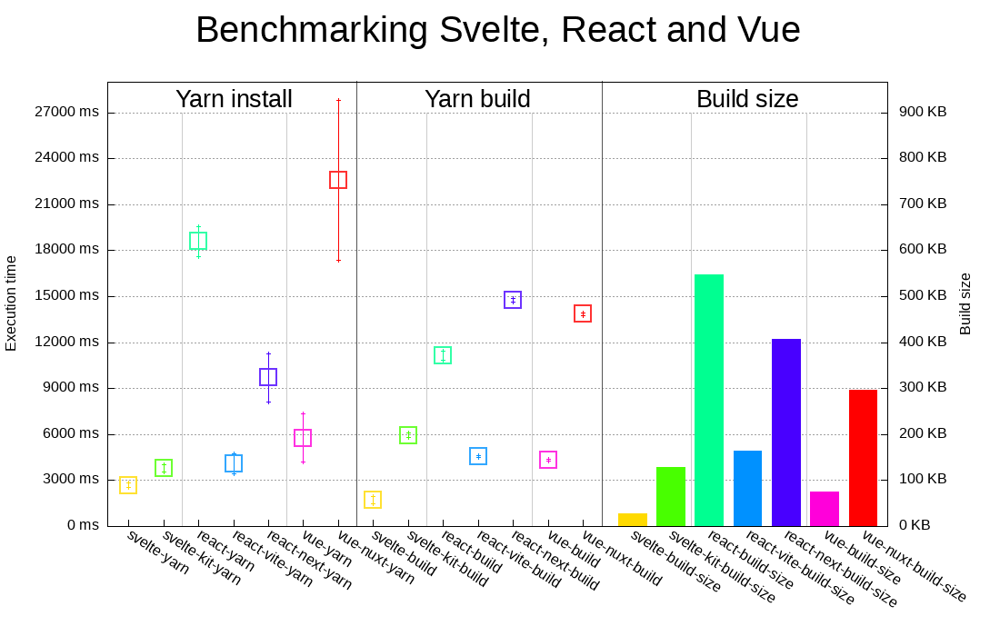

Svelte vs React vs Vue
======================

This is repo contains some tools to benchmark how Svelte, React and Vue can compete together on some technical requirements:

* Install time
* Build time
* Build size

## How it works

First, we need to have the same application for all three frameworks.

Then, these applications are integrated in both their "classic" and "fullstack" toolset. For instance, React is used for a classic app and a Next.js app. Same for Svelte and SvelteKit, and as well for Vue.js and Nuxt.

This has some "opinionated" ways to be compared, because for instance with Svelte you have native stores, whereas with Vue you don't and have to use either the `reactive` tools or the Vuex library.

I deliberately chose to not use external libraries to compare the frameworks in their lightest forms and avoid adding biases based on the fact that other libraries are used.

## Current results

This graph was generated using the [gnuplot](http://www.gnuplot.info/) tool, you can check this project's [graph.gnuplot](./graph.gnuplot) file to see how it was generated.

The benchmark ran over 2000 tests on the same machine, a small dedicated server, so the most important here is to **not compare time, but proportions instead** (except for build size which is consistent over all platforms).

---

Pictured results:

## How to reproduce

You need several tools:

* [processtime](https://crates.io/crates/processtime), a very small binary that calculates execution time with a computer-usable output. You can quickly install it by [installing the Rust langauge](https://www.rust-lang.org/fr) and running `cargo install processtime`.
* [gnuplot](http://www.gnuplot.info/), which is available in most linux platforms via your favourite package manager.
* [Node.js](http://nodejs.org/) and the [yarn](https://yarnpkg.com/) package manager.
* The `du` tool, which is built-in on most linux/unix platforms.

### Generation process

To generate **one** benchmark, run `./test.bash`.

This will clean everything up and execute all script commands procedurally **one by one** so that process time is consistent and no other running process might interfere with performances.

The data results will then be appended to the `results.csv` file.

> Note: remember to **keep the first line** of the CSV file. It serves as headers for the graphs.

Next, once you have enough data in your set, run the `gnuplot graph.gnuplot` command.

Depending on the size of your data set, it might take some time, so please be patient 😉.

With 600+ lines, on my machine, it takes about 20 seconds to generate.

Then, you can enjoy visualizing the results on the `output.png` file!
