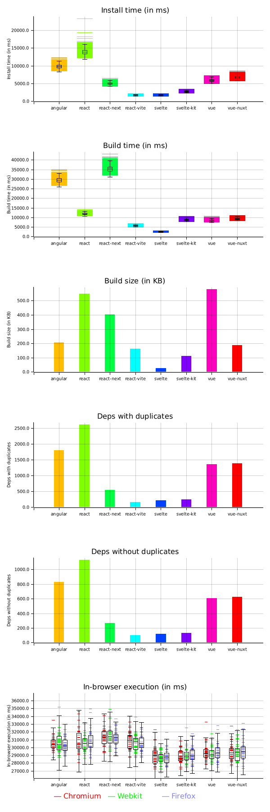
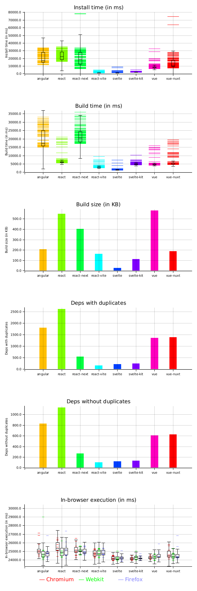

Svelte vs React vs Vue vs Angular
=================================

This is repo contains some tools to benchmark how Svelte, React and Vue can compete together on some technical requirements:

* Install time
* Build time
* Build size

## How it works

First, we have the same application for all three frameworks and their variants. A small "todo list" app.

These applications are integrated in both their "classic" and "fullstack" toolset. For instance, React is used for a classic app and a Next.js app. Same for Svelte and SvelteKit, and as well for Vue.js and Nuxt.

This has some "opinionated" ways to be compared, because for instance with Svelte you have native stores, whereas with Vue you don't and have to use either the `reactive` tools or the Vuex library.

I deliberately chose to not use external libraries to compare the frameworks in their lightest forms and avoid adding biases based on the fact that other libraries are used.

## Current results

This graph was generated using the [plotters](https://plotters-rs.github.io/rustdoc/plotters/index.html) tool in Rust, you can check this project's [main.rs](./graphs/src/main.rs) file to see how it was generated.

The benchmark is lots of build tests and runtime tests that ran on the same machine, a small dedicated server, so the most important here is to **not compare time, but proportions instead** (except for build size which is consistent over all platforms, hence the simple bar chart).

---

Pictured results:

| Server                       | VPS                         | Local machine                 |
|------------------------------|-----------------------------|-------------------------------|
| Results                      |  |  |
| Number of build benchmarks   | 2199 | 118 |
| Number of runtime benchmarks | 367 | 13 |

## How to reproduce

You need several tools:

* [Rust](https://www.rust-lang.org/tools/install), to generate the graphs.
* [processtime](https://crates.io/crates/processtime), a very small binary that calculates execution time with a computer-usable output.<br>You can quickly install it by installing the Rust language and running `cargo install processtime`.
* [Node.js](http://nodejs.org/) and the [yarn](https://yarnpkg.com/) package manager.
* Set up [Playwright](https://playwright.dev/) (see below), for runtime performance benchmark.
* [jq](https://stedolan.github.io/jq/), to gather Playwright results that are stored in JSON.
* The `du` tool, which is built-in on most linux/unix platforms.

### Set up Playwright

To set it up, run these commands:

```bash
yarn
yarn playwright install-deps # This one will ask for "sudo" permissions
yarn playwright install
```

### Generation process

There are **3 scripts** depending to generate everything for the benchmarks

#### Script 1: generate performance data

First you need to **name** the output directory you want in the `output/` dir. There are already two directories, `vps` and `local`, each representing the current data that I generated while working on these benchmarks, but you can create another one, as you want.

Then, run the `./bench_it_all.bash` script and add the output directory name with one of these methods:

```bash
./bench_it_all.bash my_output_dir

# Or:
OUTPUT_DIR=my_output_dir ./bench_it_all.bash

# Or even:
export OUTPUT_DIR=my_output_dir
./bench_it_all.bash
```

This will create a `output/my_output_dir/` directory where you will find all the **latest** logs (only the latest, not all, to avoid bloating your hard drive with useless logs), as well as the actual data in the CSV files.

#### Script 2: generate image graphs

Once you have all the requirements, run the generation script followed by the output directory you specified earlier. If you have exported the `OUTPUT_DIR` var, the script will reuse it.

Like in the previous chapter, here are usage examples:

```bash
./generate_graph.bash my_output_dir

# Or:
OUTPUT_DIR=my_output_dir ./generate_graph.bash

# Or even:
export OUTPUT_DIR=my_output_dir
./generate_graph.bash
```

This will create a `output/graph_my_output_dir.png` image file that contains the graphs generated with your custom data.

#### Script 3: update the readme with "vps" and "local" data

If at some point you wanted to reuse the `vps` or `local` data for checks, you could use the readme script update in which these datasets are hardcoded in order to link the graphs in the README.md file.

The main goal of this script is to update the amount of tests that were executed for each dataset. Nothing really special apart that.

Usage:

```
./update_readme_results.bash
```

### License

This project is under the AGPL-3.0 license, so reusability across any other machine or computer requires you to publish your modifications publicly with the exact same license if you do so.<br>
Best solution is to provide an issue or a pull-request to this repository.
