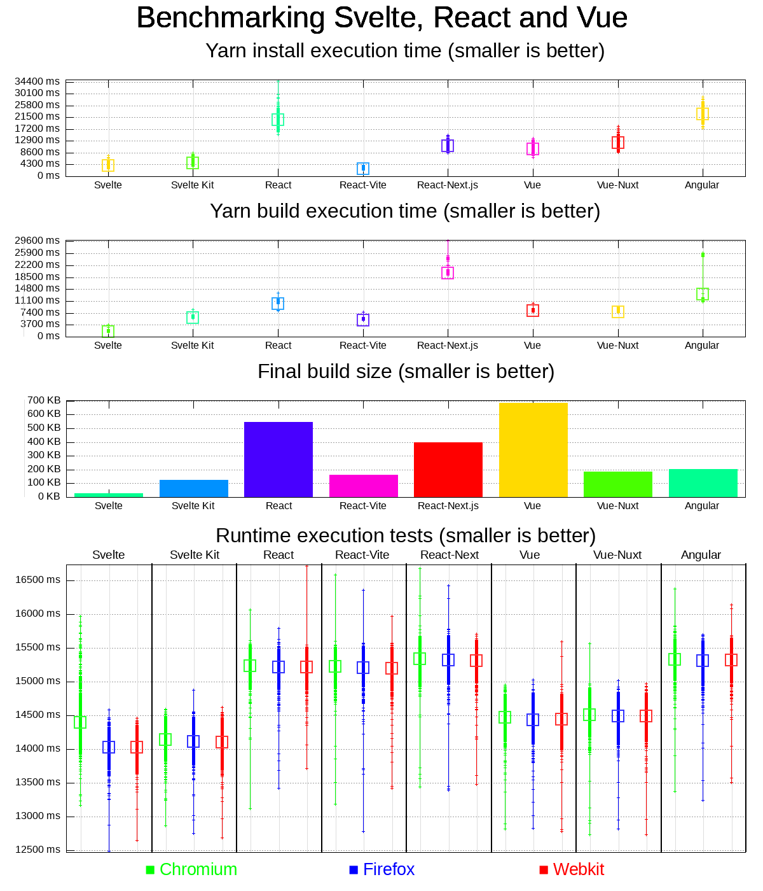

Svelte vs React vs Vue
======================

This is repo contains some tools to benchmark how Svelte, React and Vue can compete together on some technical requirements:

* Install time
* Build time
* Build size

## How it works

First, we have the same application for all three frameworks and their variants. A small "todo list" app.

These applications are integrated in both their "classic" and "fullstack" toolset. For instance, React is used for a classic app and a Next.js app. Same for Svelte and SvelteKit, and as well for Vue.js and Nuxt.

This has some "opinionated" ways to be compared, because for instance with Svelte you have native stores, whereas with Vue you don't and have to use either the `reactive` tools or the Vuex library.

I deliberately chose to not use external libraries to compare the frameworks in their lightest forms and avoid adding biases based on the fact that other libraries are used.

## Current results

This graph was generated using the [gnuplot](http://www.gnuplot.info/) tool, you can check this project's [graph.gnuplot](./graph.gnuplot) file to see how it was generated.

The benchmark is roughly a thousands of build tests and hundreds of runtime tests ran on the same machine, a small dedicated server, so the most important here is to **not compare time, but proportions instead** (except for build size which is consistent over all platforms, hence the simple bar chart).

---

Pictured results:

| Server                       | A                      | B                     | C                       |
|------------------------------|------------------------|-----------------------|-------------------------|
| Results                      |  |  |  |
| Number of build benchmarks   | 332 | 344 | | 242 |
| Number of runtime benchmarks | 332 | 343 | 19 |

## How to reproduce

You need several tools:

* [processtime](https://crates.io/crates/processtime), a very small binary that calculates execution time with a computer-usable output.<br>You can quickly install it by [installing the Rust langauge](https://www.rust-lang.org/fr) and running `cargo install processtime`.
* [gnuplot](http://www.gnuplot.info/), which is available in most linux platforms via your favourite package manager.
* [Node.js](http://nodejs.org/) and the [yarn](https://yarnpkg.com/) package manager.
* Set up [Playwright](https://playwright.dev/) (see below), for runtime performance benchmark.
* [jq](https://stedolan.github.io/jq/), to gather Playwright results that are stored in JSON.
* The `du` tool, which is built-in on most linux/unix platforms.

### Set up Playwright

To set it up, run these commands:

```bash
yarn
yarn playwright install-deps # This one will ask for "sudo" permissions
yarn playwright install
```

### Generation process

There are **two scripts** depending on the benchmark you're looking for.

1. First, create the `OUTPUT_FILE` environment variable, it will determine where your output files will be stored (CSV and plot images).
2. The `./test.bash` script runs a `build` test. It cleans up directories, installs Node.js dependencies via Yarn, and builds the apps as a static web application, and output the results to the `results.csv` file.
3. The `./runtime_test.bash` script runs a `runtime` test. It makes sure apps are built as static sites, build them if they're not, use `playwright` to start a web server for each app, run the benchmarks, and output the results to the `results_runtime.csv` file. 
4. The `./suite.bash` script runs both `test.bash` and `runtime_test.bash` consecutively. It is a helper to run all tests at once. 

If you reproduce, I recommend you to customize the `OUTPUT_FILE` environment variable to something different than the exusting files so that your data is more consistent. We cannot really use the data from different sources, as performance might be really different across platforms.

> Note: remember to **keep the first line** of the CSV files. It serves as headers for the graphs.

Next, once you have enough data in your set, run the `gnuplot graph.gnuplot` command.

Depending on the size of your data set, generating the graph might take some time, so please be patient 😉. On my servers, the whole suite takes between 4 and 9 minutes.

Then, you can enjoy visualizing the results on the output png file!
